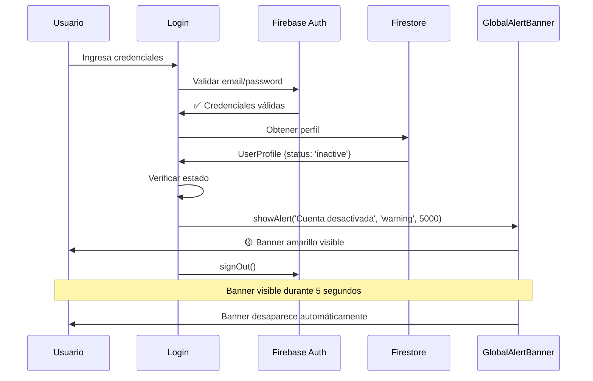

# Sistema de Banner Global de Alertas

## Descripción

Sistema de notificaciones globales tipo banner que se muestra en la parte superior de todas las páginas. Especialmente diseñado para mostrar mensajes importantes como bloqueos de cuenta, restricciones de acceso, y otros avisos críticos.

## Características

### 🎨 Estilos de Banner

| Tipo | Color | Uso |
|------|-------|-----|
| `warning` | Amarillo | Advertencias y bloqueos de cuenta |
| `error` | Rojo | Errores críticos |
| `info` | Azul | Información general |
| `success` | Verde | Confirmaciones exitosas |

### ⚡ Funcionalidades

- ✅ Banner fijo en la parte superior de la pantalla
- ✅ Duración configurable (por defecto 5 segundos)
- ✅ Cierre manual con botón X
- ✅ Barra de progreso animada
- ✅ Iconos contextuales según el tipo
- ✅ Múltiples banners simultáneos
- ✅ Animaciones de entrada y salida suaves
- ✅ Responsive y accesible

## Implementación

### 1. Contexto Global (GlobalAlertContext.tsx)

Provee la funcionalidad para mostrar y ocultar alertas desde cualquier parte de la aplicación.

```typescript
import { useGlobalAlert } from '@/context/GlobalAlertContext';

function MiComponente() {
  const { showAlert } = useGlobalAlert();
  
  // Mostrar alerta
  showAlert(
    'Mensaje del banner', 
    'warning',  // tipo: 'warning' | 'error' | 'info' | 'success'
    5000        // duración en milisegundos
  );
}
```

### 2. Componente de Banner (GlobalAlertBanner.tsx)

Renderiza los banners en la parte superior de la pantalla.

**Características visuales:**
- Borde izquierdo de color según el tipo
- Icono contextual en círculo
- Mensaje descriptivo
- Botón de cierre
- Barra de progreso animada

### 3. Integración en Layout (app/layout.tsx)

```typescript
<GlobalAlertProvider>
  <AuthProvider>
    <GlobalAlertBanner />
    {/* ... resto del contenido */}
  </AuthProvider>
</GlobalAlertProvider>
```

## Uso en Login para Usuarios Bloqueados

### Cuando un usuario intenta iniciar sesión con una cuenta bloqueada:

```typescript
// app/login/page.tsx

if (error.code === 'auth/user-deleted') {
  showAlert(
    '🚫 Acceso Denegado: Esta cuenta ha sido eliminada. Contacta al administrador.',
    'warning',
    5000
  );
}
```

### Estados de Usuario que Muestran Banner

| Estado | Mensaje |
|--------|---------|
| `status: 'deleted'` | "🚫 Acceso Denegado: Esta cuenta ha sido eliminada. Contacta al administrador si crees que es un error." |
| `status: 'inactive'` | "🚫 Acceso Denegado: Esta cuenta ha sido desactivada. Contacta al administrador para más información." |
| `isActive: false` | "🚫 Acceso Denegado: Esta cuenta no está activa. Contacta al administrador." |

## API del Sistema

### showAlert()

Muestra un banner global.

```typescript
showAlert(
  message: string,
  type?: 'warning' | 'error' | 'info' | 'success',  // default: 'warning'
  duration?: number  // default: 5000ms
)
```

**Parámetros:**
- `message`: Texto del mensaje a mostrar
- `type`: Tipo de alerta que determina el color y el icono
- `duration`: Duración en milisegundos (0 = sin auto-cierre)

**Ejemplo:**
```typescript
const { showAlert } = useGlobalAlert();

// Banner de advertencia (5 segundos)
showAlert('Usuario bloqueado', 'warning', 5000);

// Banner de error (sin auto-cierre)
showAlert('Error crítico', 'error', 0);

// Banner de éxito (3 segundos)
showAlert('Operación exitosa', 'success', 3000);
```

### hideAlert()

Cierra un banner específico.

```typescript
hideAlert(id: string)
```

## Estilos y Diseño

### Colores del Banner Warning (Amarillo)

```css
Background: bg-yellow-50
Border: border-yellow-400
Text: text-yellow-800
Icon: text-yellow-600
Icon Background: bg-yellow-100
```

### Animaciones

1. **Entrada**: Desliza desde arriba con fade-in (300ms)
2. **Salida**: Desliza hacia arriba con fade-out (300ms)
3. **Barra de progreso**: Animación linear desde 100% a 0%

### Posicionamiento

```css
position: fixed
top: 0
left: 0
right: 0
z-index: 9999
```

## Casos de Uso

### 1. Bloqueo de Login

```typescript
// Usuario bloqueado intenta iniciar sesión
try {
  await loginUser(email, password);
} catch (error) {
  if (error.code === 'auth/user-disabled') {
    showAlert(
      '🚫 Acceso Denegado: Cuenta desactivada',
      'warning',
      5000
    );
  }
}
```

### 2. Sesión Expirada

```typescript
// Detectar sesión inválida
if (userStatus !== 'active') {
  showAlert(
    'Tu sesión ha expirado. Por favor, inicia sesión nuevamente.',
    'info',
    5000
  );
  await signOut();
}
```

### 3. Permisos Insuficientes

```typescript
// Usuario sin permisos intenta acceder a una función
if (!hasPermission('admin_panel')) {
  showAlert(
    'No tienes permisos para acceder a esta función.',
    'error',
    5000
  );
}
```

### 4. Mantenimiento Programado

```typescript
// Mostrar aviso de mantenimiento
useEffect(() => {
  if (isMaintenanceMode) {
    showAlert(
      'El sistema estará en mantenimiento desde las 2:00 AM hasta las 4:00 AM.',
      'info',
      10000
    );
  }
}, []);
```

## Diferencias con Toast

| Característica | Banner Global | Toast |
|----------------|---------------|-------|
| Posición | Fijo en la parte superior | Esquina superior derecha |
| Visibilidad | Más prominente | Menos intrusivo |
| Uso | Avisos críticos | Confirmaciones rápidas |
| Duración | Configurable (5s por defecto) | 3-4s |
| Múltiples | Apilados verticalmente | Apilados con scroll |

## Flujo de Usuario Bloqueado



## Personalización

### Cambiar Duración por Defecto

```typescript
// En GlobalAlertContext.tsx
const showAlert = useCallback((
  message: string, 
  type: AlertType = 'warning', 
  duration: number = 7000  // Cambiar aquí
) => {
  // ...
}, []);
```

### Agregar Nuevo Tipo de Alerta

```typescript
// En GlobalAlertContext.tsx
export type AlertType = 'warning' | 'error' | 'info' | 'success' | 'critical';

// En GlobalAlertBanner.tsx
const colors = {
  // ... otros tipos
  critical: {
    bg: 'bg-purple-50 border-purple-400',
    text: 'text-purple-800',
    icon: 'text-purple-600',
    iconBg: 'bg-purple-100',
  }
};
```

### Cambiar Posición

```typescript
// En GlobalAlertBanner.tsx
<div className="fixed bottom-0 left-0 right-0 z-[9999]">
  {/* Banner en la parte inferior */}
</div>
```

## Accesibilidad

- ✅ Atributo `role="alert"` para lectores de pantalla
- ✅ Botón de cierre con `aria-label="Cerrar"`
- ✅ Contraste de colores WCAG AA
- ✅ Keyboard navigation
- ✅ Focus visible en el botón de cierre

## Testing

### Test Manual

1. **Iniciar aplicación:**
   ```bash
   npm run dev
   ```

2. **Probar banner de bloqueo:**
   - Desactivar un usuario con el script
   - Intentar iniciar sesión
   - Verificar que aparece el banner amarillo
   - Verificar que dura 5 segundos
   - Verificar que se puede cerrar manualmente

3. **Probar múltiples banners:**
   - Activar múltiples alertas rápidamente
   - Verificar que se apilan correctamente
   - Verificar que cada una desaparece según su duración

### Test con Script

```bash
# Terminal 1: Servidor
npm run dev

# Terminal 2: Script de prueba
node scripts/test-blocked-user-login.js
```

## Archivos del Sistema

| Archivo | Propósito |
|---------|-----------|
| `context/GlobalAlertContext.tsx` | Contexto y lógica del sistema |
| `components/GlobalAlertBanner.tsx` | Componente visual del banner |
| `app/layout.tsx` | Integración en el layout principal |
| `app/login/page.tsx` | Uso en página de login |

## Mejoras Futuras

### Posibles Extensiones

- [ ] Sonido al mostrar alertas críticas
- [ ] Persistencia en localStorage para mensajes importantes
- [ ] Animaciones más elaboradas
- [ ] Soporte para mensajes con HTML
- [ ] Botones de acción personalizados
- [ ] Límite máximo de banners simultáneos
- [ ] Cola de mensajes prioritarios

### Integración con Notificaciones Push

```typescript
// Mostrar notificación del navegador + banner
if ('Notification' in window && Notification.permission === 'granted') {
  new Notification('Cuenta Bloqueada', {
    body: message,
    icon: '/logo.png'
  });
}
showAlert(message, 'warning', 5000);
```

## Troubleshooting

### El banner no aparece

**Causas posibles:**
1. GlobalAlertProvider no está en el layout
2. z-index insuficiente
3. Error en la lógica del showAlert

**Solución:**
```typescript
// Verificar en app/layout.tsx
<GlobalAlertProvider>
  <GlobalAlertBanner />
  {/* ... */}
</GlobalAlertProvider>
```

### El banner no desaparece automáticamente

**Causas posibles:**
1. duration = 0 (sin auto-cierre)
2. Error en el setTimeout

**Solución:**
```typescript
// Verificar que duration > 0
showAlert('Mensaje', 'warning', 5000); // ✅ Correcto
showAlert('Mensaje', 'warning', 0);    // ❌ No se cerrará automáticamente
```

### Múltiples banners se superponen

**Causa:** z-index insuficiente o estilos conflictivos

**Solución:**
```css
/* En GlobalAlertBanner.tsx */
z-index: 9999
```

## Recursos Adicionales

- **Lucide Icons:** https://lucide.dev/
- **Tailwind CSS:** https://tailwindcss.com/
- **React Context:** https://react.dev/reference/react/useContext

---

**Fecha de Implementación:** 8 de octubre de 2025  
**Estado:** ✅ IMPLEMENTADO Y FUNCIONAL  
**Versión:** 1.0.0

