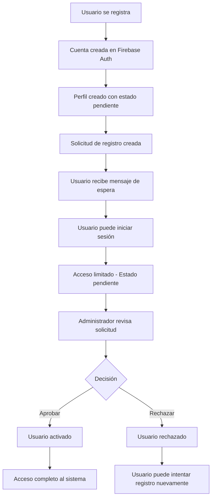

# Sistema de Registro con Aprobación - Calle Jerusalén Community

## 📋 Descripción General

El sistema de registro ha sido actualizado para implementar un flujo de aprobación donde los usuarios deben esperar que un administrador apruebe su solicitud de registro antes de poder acceder completamente al sistema.

## 🔄 Flujo del Sistema

### 1. **Registro de Usuario**
- El usuario completa el formulario de registro en `/register`
- Se crea una cuenta en Firebase Authentication
- Se crea un perfil en Firestore con estado `inactive` y `registrationStatus: 'pending'`
- Se crea una solicitud de registro en la colección `registrationRequests`
- El usuario recibe un mensaje indicando que debe esperar aprobación

### 2. **Estado Pendiente**
- El usuario puede iniciar sesión pero no tiene acceso completo
- Al intentar acceder a rutas protegidas, se muestra el componente `RegistrationStatus`
- Se muestra información sobre el estado de su solicitud

### 3. **Aprobación por Administrador**
- Los administradores pueden ver las solicitudes pendientes en `/admin/admin-dashboard`
- Pueden aprobar o rechazar las solicitudes
- Al aprobar: se actualiza el perfil del usuario a `active` y se asignan permisos
- Al rechazar: se actualiza el estado a `rejected` con una razón

### 4. **Acceso Completo**
- Una vez aprobado, el usuario tiene acceso completo al sistema
- Puede acceder a todas las funcionalidades según su rol

## 🗂️ Estructura de Datos

### Perfil de Usuario (Colección: `users`)
```typescript
interface UserProfile {
  uid: string;
  email: string;
  displayName: string;
  role: UserRole;
  status: 'active' | 'inactive' | 'deleted';
  createdAt: Date;
  updatedAt: Date;
  isActive: boolean;
  permissions: Permission[];
  registrationStatus: 'pending' | 'approved' | 'rejected';
  approvedBy?: string;
  approvedAt?: Date;
  statusChangedBy?: string;
  statusChangedAt?: Date;
  statusReason?: string;
}
```

### Solicitud de Registro (Colección: `registrationRequests`)
```typescript
interface RegistrationRequest {
  id: string; // Mismo que el UID del usuario
  email: string;
  displayName: string;
  requestedRole: UserRole;
  createdAt: Date;
  status: 'pending' | 'approved' | 'rejected';
  processedBy?: string;
  processedAt?: Date;
  reason?: string;
}
```

## 🔧 Funciones Principales

### `registerUser()`
- Crea usuario en Firebase Auth
- Crea perfil con estado pendiente
- Crea solicitud de registro
- Registra la acción en logs

### `approveRegistration()`
- Actualiza la solicitud a `approved`
- Actualiza el perfil del usuario a `active`
- Asigna permisos según el rol
- Registra la acción en logs

### `rejectRegistration()`
- Actualiza la solicitud a `rejected`
- Actualiza el perfil del usuario con estado rechazado
- Registra la razón del rechazo
- Registra la acción en logs

## 🎨 Componentes de Interfaz

### `RegistrationStatus`
- Muestra el estado de la solicitud de registro
- Diferentes vistas para pendiente, aprobado y rechazado
- Información sobre próximos pasos

### `ProtectedRoute`
- Verifica el estado de registro antes de permitir acceso
- Redirige a `RegistrationStatus` si está pendiente o rechazado
- Mantiene la funcionalidad de verificación de permisos

## 📊 Panel de Administración

### Gestión de Solicitudes
- Lista de solicitudes pendientes
- Botones para aprobar/rechazar
- Información detallada de cada solicitud
- Filtros y búsqueda

### Estadísticas
- Contador de solicitudes pendientes
- Métricas de aprobación/rechazo
- Historial de acciones

## 🔐 Seguridad

### Validaciones
- Solo usuarios con permisos de administrador pueden aprobar/rechazar
- Verificación de estado en cada acceso
- Logs completos de todas las acciones

### Estados de Usuario
- `pending`: Esperando aprobación
- `approved`: Aprobado y activo
- `rejected`: Rechazado
- `inactive`: Desactivado por administrador
- `deleted`: Eliminado del sistema

## 🧪 Pruebas

### Script de Prueba
```bash
npm run test-registration
```

Este script:
- Crea un usuario de prueba
- Verifica que se crea el perfil con estado pendiente
- Verifica que se crea la solicitud de registro
- Limpia el usuario de prueba

## 📝 Logs y Auditoría

### Acciones Registradas
- `registration_request_created`: Nueva solicitud de registro
- `registration_approved`: Solicitud aprobada
- `registration_rejected`: Solicitud rechazada

### Información Registrada
- Usuario que realizó la acción
- Usuario afectado
- Timestamp de la acción
- Detalles adicionales (razón, rol asignado, etc.)

## 🚀 Implementación

### Archivos Modificados
- `lib/auth.ts`: Funciones de registro y aprobación
- `app/register/page.tsx`: Interfaz de registro actualizada
- `context/AuthContext.tsx`: Verificación de estado de registro
- `components/ProtectedRoute.tsx`: Verificación de acceso
- `components/RegistrationStatus.tsx`: Componente de estado

### Archivos Nuevos
- `components/RegistrationStatus.tsx`: Muestra estado de registro
- `scripts/test-registration-system.js`: Script de pruebas
- `SISTEMA_REGISTRO_APROBACION.md`: Esta documentación

## ✅ Beneficios

1. **Control de Acceso**: Solo usuarios verificados pueden acceder
2. **Seguridad**: Prevención de registros no autorizados
3. **Auditoría**: Registro completo de todas las acciones
4. **Flexibilidad**: Los administradores pueden aprobar/rechazar según criterios
5. **Transparencia**: Los usuarios conocen el estado de su solicitud

## 🔄 Flujo de Usuario



## 📞 Soporte

Para problemas o preguntas sobre el sistema de registro:
1. Revisar los logs del sistema
2. Verificar el estado en Firestore
3. Consultar la documentación de Firebase
4. Contactar al administrador del sistema
